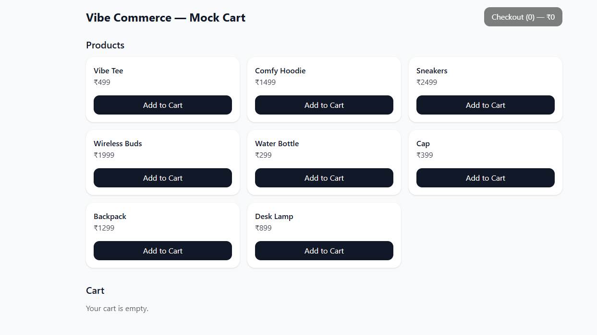
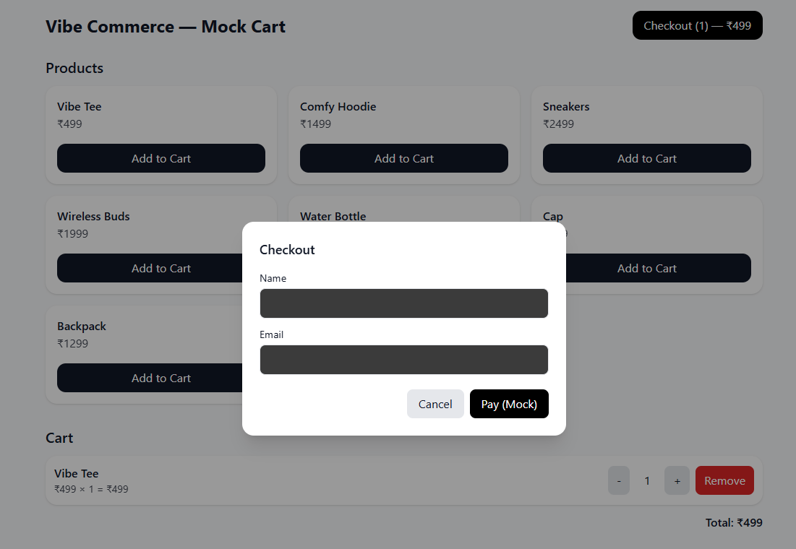
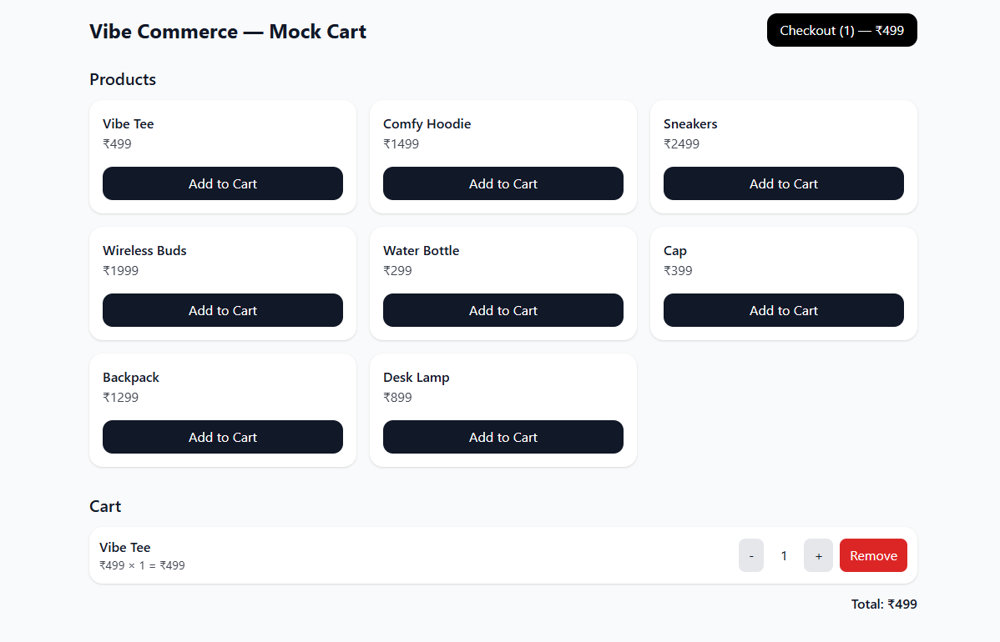
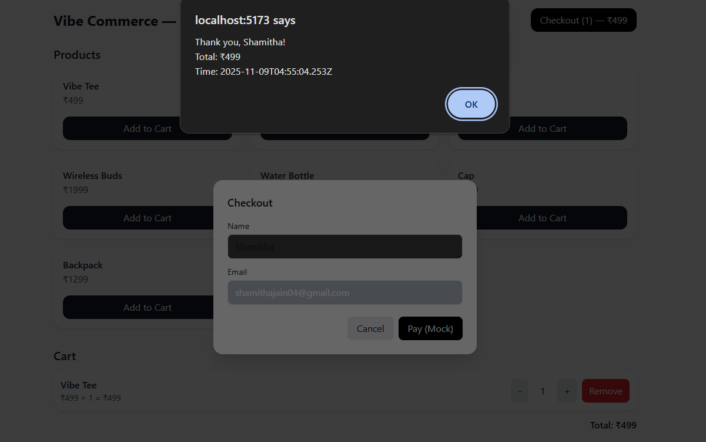

# Vibe Commerce — Mock E-Com Cart

A minimal full‑stack cart app for the Vibe Commerce screening.

**Tech:** React (Vite) + Tailwind, Node/Express, SQLite (better-sqlite3).  
**APIs:** REST under `/api/*`.  
**Bonus:** Optional Fake Store API integration (`USE_FAKE_STORE=1`).

---

## Demo (local)

### 1) Backend
```bash
cd backend
cp .env.example .env        # optional; defaults are fine
npm install
npm run seed                # clears cart table
npm run dev                 # starts http://localhost:5000
```

### 2) Frontend
```bash
cd ../frontend
npm install
npm run dev                 # starts http://localhost:5173
```

The frontend proxies `/api` to the backend.

---

## API Contract

- **GET `/api/products`** → `[{ id, name, price }]`
- **POST `/api/cart`** → body `{{ productId, name, price, qty }}`  
  Adds or updates the item (qty replaces existing). If `qty <= 0`, item is removed.
- **DELETE `/api/cart/:id`** → removes cart row by id.
- **GET `/api/cart`** → `{{ items: [...], total }}`
- **POST `/api/checkout`** → clears cart, returns mock receipt `{{ total, timestamp, itemsCount }}`

---

## Frontend Features

- Products grid with "Add to Cart"
- Cart list with qty increment/decrement and remove
- Checkout modal (name & email) → mock receipt alert
- Responsive styling via Tailwind

---

## Bonus

- **DB persistence:** SQLite file (`DB_FILE`) stores the cart.
- **Fake Store:** `USE_FAKE_STORE=1` to fetch from `FAKE_STORE_URL` (normalized to `{id,name,price}`).
- **Error handling:** Basic 4xx/5xx handling in API with meaningful messages.

---

## Repo Structure

```
/backend
  server.js
  src/db.js
  package.json
  .env.example
  seed.js

/frontend
  index.html
  vite.config.js
  package.json
  postcss.config.js
  tailwind.config.js
  /src
    /components
      Cart.jsx
      CheckoutModal.jsx
      ProductGrid.jsx
    App.jsx
    main.jsx
    /styles/index.css
<<<<<<< HEAD
```
=======

=======

=======
>>>>>>> 3ffdf26 (Updated README with screenshots and latest info)
## Notes

- No real payments.
- Can be deployed later (Render/Netlify/etc.), but the task only requires GitHub.
- Tested locally with Node 20.

## Screenshots

### 🏠 Home Page


### 🔐 Login Page


### 🛒 Add to Cart Page


### 💳 Checkout Page


